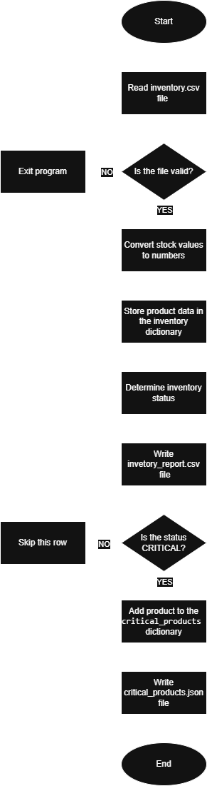

Title:

    Inventory Status Reporter

Description:

    This program analyzes an inventory.csv file, calculates the stock status for each product,
    and generates two output files.

    First, the program creates an inventory_report.csv file containing the calculated statuses.
    Then, it generates a critical_products.json file containing only the critical products.

    The goal of this program is to quickly identify products with critical stock levels and
    reduce manual checking time.

Input:

    - File path: Inventory Status Reporter/input/inventory.csv
    - Format: CSV

    Required columns:

    - product_name
    - current_stock
    - minimum_stock

Output:

    First output file:

    - File path: Inventory Status Reporter/output/inventory_report.csv
    - Format: CSV
    - Content: Product data with an additional status column

    Second output file:

    - File path: Inventory Status Reporter/output/critical_products.json
    - Format: JSON
    - Content: Only products with CRITICAL status

Status values:

    - OK >> current_stock is greater than minimum_stock
    - WARNING >> current_stock is equal to minimum_stock
    - CRITICAL >> current_stock is lower than minimum_stock

Run:

    python main.py

Used technologies:

    - Language: Python

Libraries:

    - csv
    - json
    - pathlib
    - sys

    Purpose of pathlib.Path:

    - Used for cleaner and platform-independent file path handling

## Flowchart

